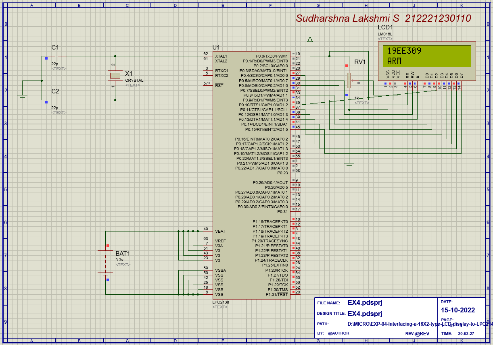
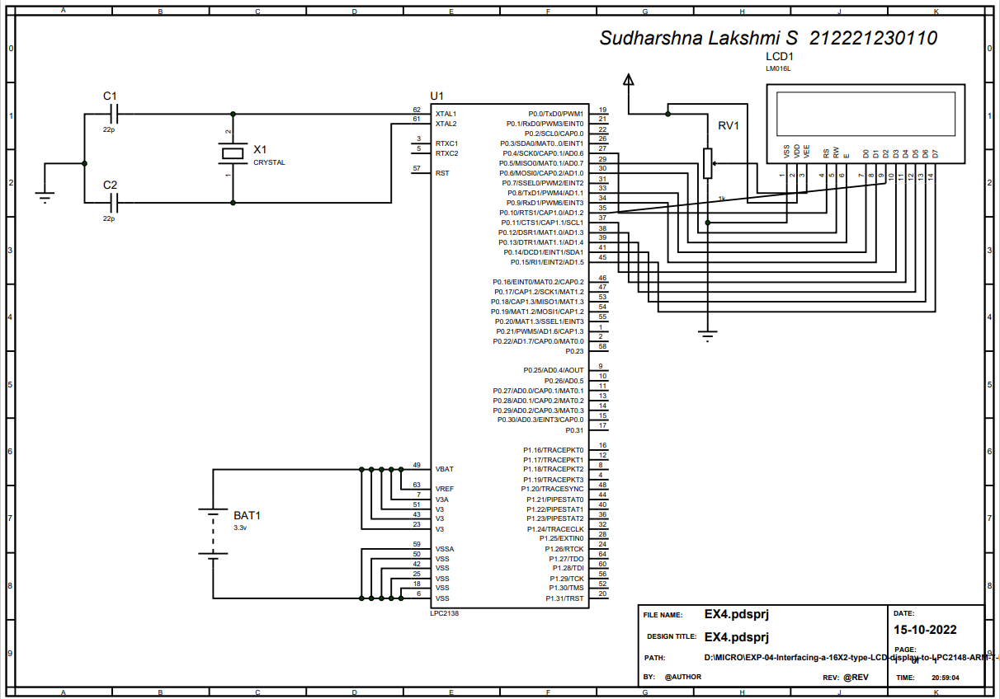

# EXP 04 Inerfacing a 16X2 type LCD display to LPC2148 ARM 7 Microcontroller
```
Name : virgil jovita.a
Roll no : 212221240062
```
## Aim
To Interface 16X2 type LCD display to LPC2148 ARM 7 and write a code for displaying a string to it
## Components required
Proteus ISIS professional suite, Kiel μ vision 5 Development environment 
## Theory 
 
# LCD16X2 
 
 


 
 
 
Fig.01 16X2 LCD DISPLAY 


Apart from the voltage supply connections the important pins from the programming perspective are the data lines(8-bit Data bus), Register select, Read/Write and Enable pin.

Data Bus: As shown in the above figure and table, an alpha numeric lcd has a 8-bit data bus referenced as D0-D7. As it is a 8-bit data bus, we can send the data/cmd to LCD in bytes. It also provides the provision to send the the data/cmd in chunks of 4-bit, which is used when there are limited number of GPIO lines on the microcontroller.

Register Select(RS): The LCD has two register namely a Data register and Command register. Any data that needs to be displayed on the LCD has to be written to the data register of LCD. Command can be issued to LCD by writing it to Command register of LCD. This signal is used to differentiate the data/cmd received by the LCD.
If the RS signal is LOW then the LCD interprets the 8-bit info as Command and writes it Command register and performs the action as per the command.
If the RS signal is HIGH then the LCD interprets the 8-bit info as data and copies it to data register. After that the LCD decodes the data for generating the 5x7 pattern and finally displays on the LCD.

Read/Write(RW): This signal is used to write the data/cmd to LCD and reads the busy flag of LCD. For write operation the RW should be LOW and for read operation the R/W should be HIGH.

Enable(EN): This pin is used to send the enable trigger to LCD. After sending the data/cmd, Selecting the data/cmd register, Selecting the Write operation. A HIGH-to-LOW pulse has to be send on this enable pin which will latch the info into the LCD register and triggers the LCD to act accordingly.

Procedure:
For creation of project on    Kiel μ vision 5 Development environment (LPC21 XX/48/38)
1.	Click on the menu Project — New µVision Project creates a new project. Select an empty folder and enter the project name, for example Project1. It is good practice to use a separate folder for each project.
2.	Next, the dialog Select Device for Target opens.

 


Figure -02 Target selection


Select the device database. Default is Software Packs. You can have various local device databases, which show up in the drop-down box. For legacy devices (Arm7, Arm9), use the Legacy Device Database [no RTE]
3.	Select the device for your application. This selection defines essential tool settings such as compiler controls, the memory layout for the linker, and the Flash programming algorithms.
4.	Click OK.
5.	Click on the new file option and save the file using save option with .C extension 
6.	Build all for the hex code in the output of the target

For creating the simulation environment in Proteus suite 
Starting New Design


Step 1: Open ISIS software and select New design in  File menu
 
Figure -03 Proteus File Menu

 Step 2: A dialogue box appears to save the current design. However, we are creating a new design file so you can click Yes or No depending on the content of the present file. Then a Pop-Up appears asking to select the template. It is similar to selecting the paper size while printing. For now select default or according to the layout size of the circuit.
 
 
 

  Figure -03 Proteus Default Template Select
  
    
 
Step 3:An untitled design sheet will be opened, save it according to your wish,it is better to create a new folder for every layout as it generates other files supporting your design. However,it is not mandatory.
  Figure -05 Proteus Design Sheet
 
Step 4:To Select components, Click on the component mode button.
 

Figure -06 Component Mode
Step 5:Click On Pick from Libraries. It shows the categories of components available and a search option to enter the part name.
 

  Figure -07 Pick from Libraries

Step 6: Select the components from categories or type the part name in Keywords text box.
 Place all the required components and route the wires i.e, make connections.
Either selection mode above the component mode or component mode allows to connect through wires. Left click from one terminal to other to make connection. Double right-click on the connected wire or the component to remove connection or the component respectively.
 
 Figure -08 Component Properties Selection
Double click on the component to edit the properties of the components and click on Ok.
Step 8: Select ARM microcontroller form the library – pick part 
 

Figure -09 LPC2138/48 selection
Step 7:

After making necessary connections click on debug from 


 Figure -09 Keywords Textbox
Example shows selection of push button. Select the components accordingly.
 
 

 

Figure -11 Circuit diagram of 16x2 LCD interface with LPC2148/38


 
Figure -12 Hex file for simulation 

Step 9: Select the hex file from the Kiel program folder and import the program in to the microcontroller as shown in figure 11 ,  debug and if no errors in connections are found, run the VSM simulation to view the output.


## Kiel - Program  
```
#include <lpc214x.h>
#include <stdint.h>
#include <stdlib.h>
#include <stdio.h>

void delay_ms(uint16_t j) /* Function for delay in milliseconds  */
{
    uint16_t x,i;
	for(i=0;i<j;i++)
	{
    for(x=0; x<6000; x++);    /* loop to generate 1 millisecond delay with Cclk = 60MHz */
	}
}

void LCD_CMD(char command)
{
	IO0PIN = ( (IO0PIN & 0xFFFF00FF) | (command<<8) );
	IO0SET = 0x00000040; /* EN = 1 */
	IO0CLR = 0x00000030; /* RS = 0, RW = 0 */
	delay_ms(2);
	IO0CLR = 0x00000040; /* EN = 0, RS and RW unchanged(i.e. RS = RW = 0) */
	delay_ms(5);
}

void LCD_INIT(void)
{
	IO0DIR = 0x0000FFF0; /* P0.8 to P0.15 LCD Data. P0.4,5,6 as RS RW and EN */
	delay_ms(20);
	LCD_CMD(0x38);  /* Initialize lcd */
	LCD_CMD(0x0C);   /* Display on cursor off */
	LCD_CMD(0x06);  /* Auto increment cursor */
	LCD_CMD(0x01);   /* Display clear */
	LCD_CMD(0x80);  /* First line first position */
}

void LCD_STRING (char* msg)
{
	uint8_t i=0;
	while(msg[i]!=0)
	{
		IO0PIN = ( (IO0PIN & 0xFFFF00FF) | (msg[i]<<8) );
		IO0SET = 0x00000050; /* RS = 1, , EN = 1 */
		IO0CLR = 0x00000020; /* RW = 0 */
		delay_ms(2);
		IO0CLR = 0x00000040; /* EN = 0, RS and RW unchanged(i.e. RS = 1, RW = 0) */
		delay_ms(5);
		i++;
	}
}

void LCD_CHAR (char msg)
{
		IO0PIN = ( (IO0PIN & 0xFFFF00FF) | (msg<<8) );
		IO0SET = 0x00000050; /* RS = 1, , EN = 1 */
		IO0CLR = 0x00000020; /* RW = 0 */
		delay_ms(2);
		IO0CLR = 0x00000040; /* EN = 0, RS and RW unchanged(i.e. RS = 1, RW = 0) */
		delay_ms(5);
}

int main(void)
{
	uint8_t j;
	char val_j[3];
	j = 0;
	
	LCD_INIT();
	LCD_STRING("19EE309");//first line
	LCD_CMD(0xC0);
	LCD_STRING("ARM");//second line

	return 0;
}
```
## Proteus simulation 

### before simulation 


### after simulation 


## Layout Diagram 


## Result
Interfaced an LCD with ARM microcontroller is executed and displayed the strings.

 


